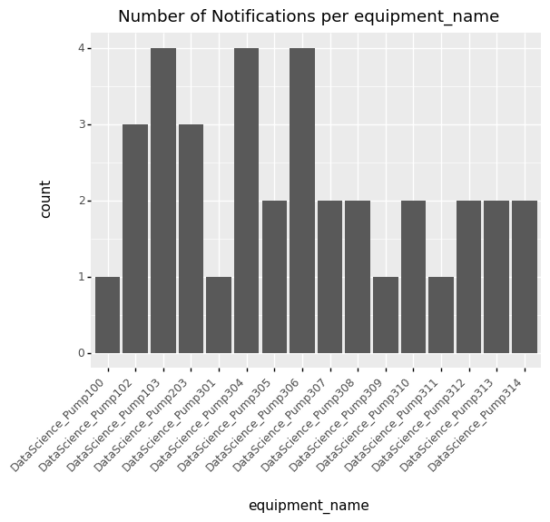

.. _tutorial:

========
Tutorial
========

In this tutorial, you will learn how to use project "Sailor" to build your own algorithms and models from data stored 
in your SAP backends. In particular, you will learn how to:

- :ref:`Configure project "Sailor" to access your SAP backend for asset master data and IoT data <how_to_configure>`
- :ref:`Read master data from AssetCentral<how_to_read_master_data>`
- :ref:`Explore and visualize master data <how_to_explore_data>`
- :ref:`Read timeseries data from SAP IoT <how_to_read_timeseries>`
- :ref:`Use the TimeseriesDataset <how_to_work_with_data>`
- :ref:`Create and update master data <how_to_write_master_data>`
- :ref:`Build custom plots on the extracted data <how_to_custom_plot>`
- :ref:`Build a machine learning model on the extracted data <how_to_model>`

.. _how_to_configure:

Configuration
=============

Before using the functions provided as part of project "Sailor," you will have to configure the package to work
with your SAP systems. For a detailed description of the configuration, please refer to the 
:doc:`Getting started guide<../introduction>`.

To start using project "Sailor," execute the following commands to load the required packages. Since the standard data 
format that is used in project "Sailor" are pandas dataframes, we also import the pandas library. You can import the required
packages like this:

.. code-block:: python 

    import pandas as pd
    from sailor.assetcentral import find_models, find_equipment, find_notifications, find_systems

.. _how_to_read_master_data:

Reading Master Data
===================

To start the analysis, we first identify the equipment of interest. We use :meth:`~sailor.assetcentral.equipment.find_equipment()` to search for the pieces of equipment 
of interest - namely those belonging to the model ``my_model_name``. The function returns a :class:`~sailor.assetcentral.equipment.EquipmentSet`,
an object representing multiple pieces of equipment. The convenience function :meth:`~sailor.assetcentral.utils.ResultSet.as_df()` returns a representation of the 
:class:`~sailor.assetcentral.equipment.EquipmentSet` as ``pandas`` dataframe.

.. code-block:: python

    equipment_set = find_equipment(model_name='my_model_name')
    equipment_set.as_df().head()

Filtering data
    Other ways of filtering are also available, e.g., for selecting the ``my_model_name`` equipment in a specific location,
    say PaloAlto::

        equipment_set2 = find_equipment(model_name='my_model_name', location_name='PaloAlto')

    For an overview of the syntax used for filtering, refer to the documentation of the :doc:`Filter Language<../filter_language>`.
    To get an overview of the fields that are available as filters, you can use the function :meth:`~sailor.assetcentral.equipment.Equipment.get_available_properties()`.
    The fields in the resulting set can be used as filters. Similar functions also exist for the other objects::

        from sailor.assetcentral.equipment import Equipment
        Equipment.get_available_properties()

    Furthermore it is possible to filter on result sets directly. Please see :meth:`~sailor.assetcentral.utils.ResultSet.filter` for details::

        equipment_set2.filter(id='ID_123')

Other typical starting points for the analysis are models. You can search for models using
:meth:`~sailor.assetcentral.model.find_models()`.

.. code-block:: python

    models = find_models(name = 'my_model_name')

You can then navigate to the equipment using :meth:`~sailor.assetcentral.model.find_equipment()`.

.. code-block:: python

    equi_for_model = models[0].find_equipment()

In case of equipment that is operated together and influences each other, the set of equipment is often modeled as System.
You can also start the analysis and exploration from a (set of) system(s) using :meth:`~sailor.assetcentral.system.find_systems`.

.. code-block:: python

    systems = find_systems(name = 'my_system')

You can analyse events that have occured on the equipment, namely notifications that were created or workorders that were performed.
Let's select all notifications that have been reported since August 2020. The :meth:`~sailor.assetcentral.equipment.EquipmentSet.find_notifications()` function can be used to search
for notifications that are linked to the equipment in the :class:`~sailor.assetcentral.equipment.EquipmentSet`. The function returns a 
:class:`~sailor.assetcentral.notification.NotificationSet`,
which represents a set of notifications, similar to the :class:`~sailor.assetcentral.equipment.EquipmentSet` for equipment. 
Again, a ``pandas`` dataframe representation of the object can be obtained using the :meth:`~sailor.assetcentral.utils.ResultSet.as_df()` function.

.. code-block:: python

    notification_set = equipment_set.find_notifications(extended_filters=['malfunction_start_date > "2020-08-01"']) 
    notification_set.as_df().head()

.. _how_to_explore_data:

Exploring Data
==============

To facilitate exploration and use of the extracted data for exploration, visualization, and model building, the :meth:`~sailor.assetcentral.utils.ResultSet.as_df()` function
is provided for all objects. The functions provide representations of the objects as ``pandas`` dataframe.

.. code-block:: python

    notification_set.as_df()
    equipment_set.as_df()

Convenience functions for typical plots are provided as part of the package. One of them is :meth:`~sailor.assetcentral.utils.ResultSet.plot_distribution()` for sets. 
This function can be used to plot the value distribution of a set with respect to a specific parameter. For example, let's
plot the distribution of notifications across equipment.

.. code-block:: python

    notification_set.plot_distribution('equipment_name')

Along the same lines, we can plot the distribution of equipment by location.

.. code-block:: python

    equipment_set.plot_distribution('location_name')

.. image:: _static/equipment_by_location.png

An additional parameter can be used to determine the coloring of the bars. All fields that are returned in :meth:`~sailor.assetcentral.utils.ResultSet.as_df()` can be 
used in the grouping or coloring.

.. code-block:: python

    notification_set.plot_distribution(by='equipment_name', fill='confirmed_failure_mode_description')

.. image:: _static/failure_mode_per_equipment.png

To visualize the distribution of notifications across equipment and time, the function :meth:`~sailor.assetcentral.notification.NotificationSet.plot_overview()` may be used. 
This will plot one row per piece of equipment associated with one of the notifications, the x-axis represents time. A colored block represents the time when
a notification was active on a piece of equipment, with the color representing the associated failure mode.

.. code-block:: python

    notification_set.plot_overview()

.. image:: _static/plot_overview.png

To understand whether there is an obvious pattern in the sensor data that is associated with a specific notification, the function
:meth:`~sailor.assetcentral.notification.Notification.plot_context()` can be used. This shows the behavior of all indicators associated with the equipment before, during, and after the 
notification. This can be useful to understand whether there are obvious differences in the sensor data prior to the notifications 
versus afterwards. This could help understand the issue associated with the notification.

.. code-block:: python

    notification_set[0].plot_context() 

Note that this filters the data for the notification locally. So if you want to plot the timeseries data for multiple notifications, it might be more efficient to create 
a timeseries dataset locally as described in :ref:`Read timeseries data<how_to_read_timeseries>` and then pass it as parameter to plot context.

.. code-block:: python

    data = equipment_set.get_indicator_data('2020-05-01 00:00:00+00:00', '2021-03-01 00:00:00+00:00')
    notification_set[0].plot_context(data)

.. _how_to_read_timeseries:

Read Timeseries Data
====================

For many use cases like anomaly detection, failure prediction, or remaining-useful-life prediction, it is useful to look at the machine's
sensor data. Sensor data is attached to equipment via indicators. An indicator is a description of measured values.

To find out which indicators are defined for a piece of equipment, you can use :meth:`~sailor.assetcentral.equipment.Equipment.find_equipment_indicators()`

.. code-block:: python

    indicators = equipment_set[0].find_equipment_indicators(name = 'my_indicator')

For a set of equipment, you can identify the set of indicators they have in common using :meth:`~sailor.assetcentral.equipment.EquipmentSet.find_common_indicators()`.
This might be useful if you want to do an analysis across multiple pieces of equipment.

.. code-block:: python

    indicators = equipment_set.find_common_indicators()

To retrieve timeseries data from SAP IoT for the indicators of interest, you use the function :meth:`~sailor.assetcentral.equipment.Equipment.get_indicator_data()`.
This retrieves data for a single piece of equipment.

.. code-block:: python

    data = equipment_set[0].get_indicator_data('2020-05-01 00:00:00+00:00', '2021-03-01 00:00:00+00:00', indicators)

If you leave indicator set blank, then all indicators attached to the piece of equipment will be fetched.

For retrieving timeseries data for multiple pieces of equipment, it is more efficient to use the function :meth:`~sailor.assetcentral.equipment.EquipmentSet.get_indicator_data()`.
If here the indicator set is left blank, then all indicators returned by :meth:`~sailor.assetcentral.equipment.EquipmentSet.find_common_indicators()` are queried.

.. code-block:: python

    data = equipment_set.get_indicator_data('2020-10-01 00:00:00+00:00', '2021-01-01 00:00:00+00:00')

.. _how_to_work_with_data:

Working with Timeseries Data
============================
Timeseries data is always returned as a :class:`~sailor.sap_iot.wrappers.TimeseriesDataset`.
With this object you have some options on how to work with the data contained within it.

You can retrieve the data as a DataFrame::

    data.as_df(speaking_names=True)

.. image:: _static/data_as_df.png

**Filtering.** E.g., filter the dataset based on a subset of indicators or equipments::

    eq_subset = data.equipment_set.filter(location_name='PaloAlto')
    ind_subset = data.indicator_set.filter(name=['DS_BearingTemperature', 'DS_OilPressure'])
    data = data.filter(equipment_set=eq_subset, indicator_set=ind_subset)

**Aggregation and interpolation.** If you are working with raw data and want to have your timeseries data aggregated.
Interpolation of ``NaN`` values is also supported::

    data = data.aggregate('24h', ['min', 'max']).interpolate('24h')

Finally, you might be interested in plotting the resulting dataset::

    data.plot()

.. image:: _static/data_plot.png

.. _how_to_write_master_data:

Writing Master Data
===================
We also aim to provide the possibility to write data to all backend systems supported by Sailor.
In this example we show you how to create notifications in AssetCentral.

Notifications are usually created for some equipment.
Therefore we can use the :meth:`~sailor.assetcentral.equipment.Equipment.create_notification` function 
to create a new notification for an equipment. In this example we want to create a new breakdown notification 
with high priority::

    equi = equipment_set[0]
    notif = equi.create_notification(
                    status='NEW', notification_type='M2', priority=25,
                    short_description='Valve broken',
                    start_date='2021-07-07', end_date='2021-07-08')

We might want to update this notification at a later time, e.g., when the maintenance crew is working on the equipment.
For this we need a notification object representing this notification. This can be the original ``notif`` object that 
we have created, or you can obtain the object from Assetcentral again.
We can call the :meth:`~sailor.assetcentral.notification.Notification.update` method directly on the 
Notification object to send our desired changes to Assetcentral::

    notif = find_notifications(id='previous_notification_ID')[0]
    notif.update(status='IPR')

As you can see from these examples we can use the same properties as keyword arguments, that we are familiar with,
e.g., from when using the ``find_*`` functions. 

Customization
=============
.. _how_to_custom_plot:

Building Custom Visualizations
------------------------------

To build your custom analysis or plot, you can use the data in any :class:`~sailor.assetcentral.utils.ResultSet` and transform
it into a `pandas` dataframe using :meth:`~sailor.assetcentral.utils.ResultSet.as_df()`. The data frame can then form the 
basis of your visualization.

.. code-block:: python

    import plotnine as p9
    from sailor.utils.plot_helper import _default_plot_theme
    data = equipment_set[0:4].get_indicator_data('2020-09-01 00:00:00+00:00', '2020-10-05 00:00:00+00:00')
    df = data.as_df(speaking_names=True).droplevel([0, 1], axis=1).reset_index()
    df = df.melt(id_vars=['equipment_name', 'model_name', 'timestamp'], var_name='indicator')
    p9.ggplot(df, p9.aes(x='indicator', y='value', fill='equipment_name')) + p9.geom_violin(alpha=0.6) + _default_plot_theme()

.. _how_to_model:

Building Custom Machine Learning Models
---------------------------------------

Building machine learning models can be done using the same starting point as building custom visualizations, namely the method 
:meth:`~sailor.assetcentral.utils.ResultSet.as_df()`.

This is an example of the steps necessary to train an isolation forest for detecting anomalies in the timeseries data.

.. code-block:: python

    from sklearn.ensemble import IsolationForest
    # find equipments and load data
    equi_set = find_equipment(model_name='my_model_name')
    data = equi_set.get_indicator_data('2020-09-01', '2020-10-05')
    # train isolation forest 
    iforest = IsolationForest()
    iforest.fit(data.as_df())
    # score isolation forest, and join back to index (equipment/timestamp info)
    score_data = data.as_df()
    scores = pd.Series(iforest.predict(score_data), index=score_data.index, name='score').to_frame()
